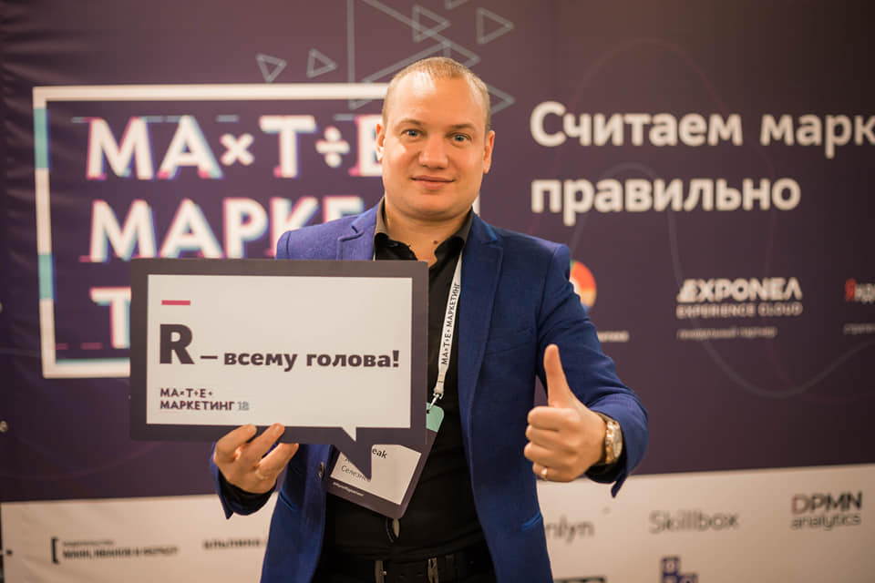

# Заключение {-}
Поздравляю вас с завершением мини курса "Циклы и функционалы в языке R"!

## Общая оценка за курс {-}
Максимальное количество баллов, которое можно было набрать при прохождении тестов 42. В связи с чем можете самостоятельно оценить насколько хорошо вы усвоили материал:

* <u>менее 24 баллов</u>: К сожалению этот курс вам ничего не дал, рекомендую начинать с курса ["Язык R для пользователей Excel"](https://selesnow.github.io/r4excel_users/), и после его прохождения повторить попытку изучения курса "Циклы и функционалы в языке R". Общая оценка по курсу **Оценка 2**.
* <u>24 - 29 балла</u>: Скорее всего вам следуюет пересмотреть лекции, т.к. вы не усвоили практически половину изложенного материала. Общая оценка по курсу **Оценка 3**.
* <u>30 - 34 баллов</u>: Вы усвоили большую часть материала, тем не менее остались важные моменты, которые пока, что судя по всему вам не понятны. Пересмотрите урок, по которому вы получили низкую оценку. Общая оценка по курсу **Оценка 4**.
* <u>35 - 42 балла</u>: Поздравляю, вы успешно ответили на подавляющее большинство вопросов в тестах, те вопросы на которые вы ответили неправильно возможно были непонятно сформулированы. Общая оценка по курсу **Оценка 5**.

Не зависимо от колличества набранных баллов я рекомендую вам не останавливаться на достингнутом, и продолжать прокачивать навыки работы в R.

## Поблагодарить автора за курс {-}
Если этот курс был вам полезен, и у вас есть желание выразить за него благодарность, вы можете перевести любую сумму на [этой странице](https://secure.wayforpay.com/payment/iteractions_in_r), либо использовать кнопку:

  <button type="button" onclick="runWfpWdgt('https://secure.wayforpay.com/button/b9c8a14345975');" style="display:inline-block!important;background:#2B3160 url('https://s3.eu-central-1.amazonaws.com/w4p-merch/button/bg2x2.png') no-repeat center right;background-size:cover;width: 256px!important;height:54px!important;border:none!important;border-radius:14px!important;padding:18px!important;box-shadow:3px 2px 8px rgba(71,66,66,0.22)!important;text-align:left!important;box-sizing:border-box!important;" onmouseover="this.style.opacity='0.8';" onmouseout="this.style.opacity='1';">Оплатить</button>

 
Буду рад видеть вас в числе подписчиков моего канала в [Telegram](https://t.me/R4marketing) и на [YouTube](https://www.youtube.com/R4marketing/?sub_confirmation=1). В канале вы найдёте очень много полезной информации по R.

Удачи вам!

*Алексей Селезнёв*

---

## Контакты автора {-}
* email: selesnow@gmail.com
* telegram канал: [R4marketing](https://t.me/R4marketing)
* youtube канал: [R4marketing](https://www.youtube.com/R4marketing/?sub_confirmation=1)
* telegram: [AlexeySeleznev](https://t.me/AlexeySeleznev)
* facebook: [selesnow](https://facebook.com/selesnow)
* github: [selesnow](https://github.com/selesnow/)
* linkedin: [selesnow](linkedin.com/in/selesnow)
* блог: [alexeyseleznev.wordpress.com](https://alexeyseleznev.wordpress.com/)

