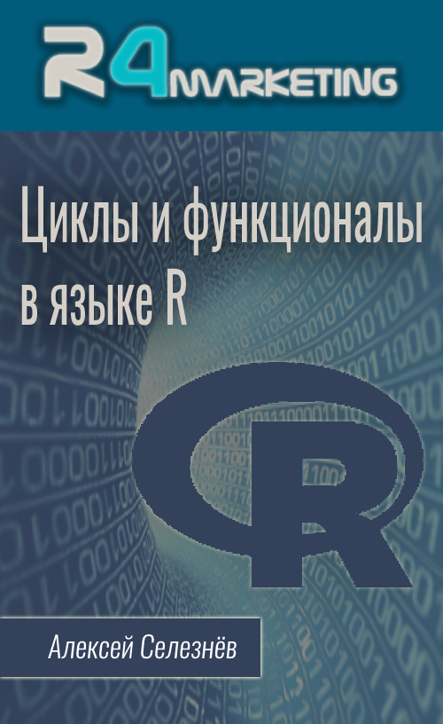

--- 
title: "Курс 'Циклы и функционалы в языке R'"
author: "Алексей Селезнёв"
date: "`r Sys.Date()`"
site: bookdown::bookdown_site
documentclass: book
bibliography: [book.bib, packages.bib]
# url: your book url like https://bookdown.org/yihui/bookdown
cover-image: img/cover.png
description: |
  Бесплатный видео мини курс по итерационным операциям и многопоточности в языке R
biblio-style: apalike
csl: chicago-fullnote-bibliography.csl
---

```{r include=FALSE}
# automatically create a bib database for R packages
knitr::write_bib(c(
  .packages(), 'bookdown', 'knitr', 'rmarkdown'
), 'packages.bib')
```

# Введение {-}

------

## О курсе {-}
<a href="https://selesnow.github.io"></a>Если вы недавно начали изучать язык R, то наверняка неоднократно слышали от более опытных коллег фразу "В R не принято использовать циклы". Связано это негласное правило с тем, что большинство функций в языке R поддерживают векторизацию, т.е. они уже под капотом имеют встроенный механизм итерирования. Даже если нужная вам функция не поддерживает векторизацию, вы всегда можете использовать функциональный стиль программирования.

Циклы, и в целом итерационные конструкции, позволяют избегать излишнего дублирования кода. Основная проблема новичков, которые только начинают учить язык R заключаются в том, что в неумелых руках циклы в R используются не эффективно, и зачастую применяются там, где они вообще не нужны. Цель этого курса научить вас эффективно использовать итерационные конструкции в языке R, и познакомить с функциональным стилем программирования, и многопоточным режимом выполнения скриптов. 

Этот курс поможет вам погрузиться в тему итерационных конструкций языка R и разобраться во всём их многообразии. Первая лекция даст вам вводную информацию о базовых циклах языка R: `for`, `while`, `repeate`. Второй урок прольёт свет на обработку ошибок, с которыми могут столкнуться написанные вами циклы. В третьем уроке мы познакомимся с функциональным стилем программирования и семейством функций `apply()`. Четвёртый урок продолжает тему функционального стиля программирования, в нём мы рассмотрим возможности пакета `purrr`, который входит в ядро библиотеки `tidyverse` и предоставляет вам более продвинутые функционалы по сравнению с семейством функций `apply()`. Следующим шагом мы разберёмся с тем, как перехватывать и обрабатывать ошибки при использовании функционалов. Затем мы узнаем как распараллеливать выполнение итераций ваших циклов и функционалов с помощью многопоточного программирования, изучим конструкцию `foreach`, пакеты `pbapply` и `furrr`. Завершающий урок будет продолжением темы параллельного программирования в R, в котором мы разберём более низкоуровневый интерфейс многопоточности предоставляемый пакетом `future`. 

## Для кого этот курс {-}
Особых требований к уровню подготовки для прохождения данного курса нет, но всё-таки в качестве первого курса для знакомства с языком R я бы его не рекомендовал. Приступать к прохождению курса "Циклы и функционалы в R" я советую тем, кто уже имеет базовые навыки работы в R. Т.е. изначально я рекомендую вам пройти курс ["Язык R для пользователей Excel"](https://selesnow.github.io/r4excel_users/), и потом приступать к прохождению данного курса.

## Рекомендации по прохождению курса {-}
Данный курс состоит из 7 видео лекций общей длительность 2 часа 55 минут, и 7 тестов включающих в себя в общей сложности 30 вопросов. Прохождение тестов не является обязательным, тем не менее я крайне советую пройти тест после просмотра лекции. Тесты помогут акцентировать ваше внимание на наиболее важных моментах урока, и проверить как вы усвоили материал. Фиксируйте баллы, которые вы набираете в ходе выполнения каждого теста, в завершении обучения на курсе, по общей сумме баллов полученных за выполнение всех тестов, вы увидите свою общую оценку за курс.

К каждому уроку есть рассмотренный в видео код, это сделано для вашего удобства, скопируйте его и выполняйте по мере просмотра видео лекции. При желании вы можете скачать все примеры кода одним архивом по [ссылке](https://github.com/selesnow/publications/blob/master/code_example/iterations_in_r_scripts.zip?raw=true).

Также в некоторых уроках вы найдёте раздел с рекомендованными материалами. В данный раздел входят ссылки на различные статьи и видео уроки, которые дополняют изложенные в ходе видео материал. Так же рекомендую не игнорировать этот раздел.

## По поводу поддержки обучающихся на данном курса {-}
**Важно!** Поддержки учащихся на этом курсе со стороны автора нет. Я не занимаюсь частными консультациями, тем более не консультирую студентов бесплатных курсов. Поэтому не имеет никакого смысла писать мне в личку или на почту просьбы помочь с прохождением этого, или любого другого моего бесплатного курса. Если вы столкнулись с трудностями при прохождении курса и вам нужна помощь, то все вопросы можно адресовать в следующие telegram чаты:

* [R (язык программирования)](https://t.me/rlang_ru)
* [Горячая линия R](https://t.me/hotlineR_EU)

Отдельного чата со студентами непосредственно этого курса не существует, но при желании вы самостоятельно можете его организовать, и я с радостью добавлю на него ссылку.

К тому же, если у вас есть вопросы по одной из лекций курса, вы можете задавать его под видео лекции на YouTube, это приветствуется, и на такие комментарии я с радостью отвечу.

Буду рад любой конструктивной критике, и предложениям по улучшению курса "Циклы и функционалы в R", направлять их можно мне на почту selesnow@gmail.com. Если вы хотите выразить благодарность мне за курс, то в конце раздела описано как это можно сделать.

## Об авторе {-}
Меня зовут Алексей Селезнёв, с 2008 года я являюсь практикующим аналитиком. На данный момент основной моей деятельностью является развитие отдела аналитики в агентстве интернет-маркетинга [Netpeak](https://https://netpeak.group/).
<a href="https://selesnow.github.io"></a>

Мною были разработаны такие R пакеты как: `rgoogleads`, `ryandexdirect`, `rfacebookstat`, `timeperiodsR`, `rvkstat` и некоторые другие. На данный момент написанные мной пакеты только с CRAN были установленны более 150 000 раз.

Также я являюсь автором курса ["Язык R для интернет-маркетинга"](https://needfordata.ru/r) и лектором академии [Web Promo Experts](https://webpromoexperts.net/).

Веду свой авторский [Telegram](https://t.me/R4marketing) и [YouTube](https://www.youtube.com/R4marketing/?sub_confirmation=1) канал R4marketing. Буду рад видеть вас в рядах подписчиков.

Периодически публикую статью на различных интернет медиа, зачастую это [Хабр](https://habr.com/ru/users/selesnow/) и [Netpeak Journal](https://netpeak.net/ru/blog/user/publication/826/).

Неоднократно выступал на профильных конференциях по аналитике и интернет маркетингу, среди которых Матемаркетинг, GoAnalytics, Analyze, eCommerce, 8P и прочие.

Начиная с 2016 года всячески стараюсь популяризировать язык R среди русскоязычных аналитиков и маркетологов. Этот курс также был создан с этой целью.

## Каналы автора {-}
Если вы интересуетесь языком R, применяете его в работе, или планируете изучать, то думаю вам будут интересны мои каналы, о которых я писал выше. Буду рад видеть вас среди подписчиков:

* [Telegram канал R4marketing](https://t.me/R4marketing)
* [Youtube канал R4marketing](https://www.youtube.com/R4marketing/?sub_confirmation=1)

## Программа курса {-}

1. [Циклы for, while и repeat](%D1%86%D0%B8%D0%BA%D0%BB%D1%8B-for-while-%D0%B8-repeat.html#%D1%86%D0%B8%D0%BA%D0%BB%D1%8B-for-while-%D0%B8-repeat)
2. [Обработка ошибок: конструкции try() и tryCatch()](обработка-ошибок-конструкции-try-и-trycatch.html)
3. [Функции семейства apply](%D1%84%D1%83%D0%BD%D0%BA%D1%86%D0%B8%D0%B8-%D1%81%D0%B5%D0%BC%D0%B5%D0%B9%D1%81%D1%82%D0%B2%D0%B0-apply.html#%D1%84%D1%83%D0%BD%D0%BA%D1%86%D0%B8%D0%B8-%D1%81%D0%B5%D0%BC%D0%B5%D0%B9%D1%81%D1%82%D0%B2%D0%B0-apply)
4. [Итерирование с помощью функций пакета purrr](%D0%BF%D0%B0%D0%BA%D0%B5%D1%82-purrr.html#%D0%BF%D0%B0%D0%BA%D0%B5%D1%82-purrr)
5. [Обработка ошибок: функции safely(), possibly(), quietly()](обработка-ошибок-функции-safely-possibly-quietly.html)
6. [Введение в многопоточность, пакеты: foreach, doFuture, pbapply, furrr](%D0%BC%D0%BD%D0%BE%D0%B3%D0%BE%D0%BF%D0%BE%D1%82%D0%BE%D1%87%D0%BD%D0%BE%D1%81%D1%82%D1%8C-%D0%B2-r.html#%D0%BC%D0%BD%D0%BE%D0%B3%D0%BE%D0%BF%D0%BE%D1%82%D0%BE%D1%87%D0%BD%D0%BE%D1%81%D1%82%D1%8C-%D0%B2-r)
7. [Реализация многопоточности с помощью пакета future](%D0%BF%D0%B0%D0%BA%D0%B5%D1%82-future.html#%D0%BF%D0%B0%D0%BA%D0%B5%D1%82-future)

## Благодарности автору {-}
Курс, и все сопутствующие материалы предоставляются бесплатно, но если у вас есть желание отблагодарить автора за этот видео курс вы можете перечислить любую произвольную сумму на [этой странице](https://secure.wayforpay.com/payment/r4excel_users).

Либо с помощью кнопки:
<center>
<script type="text/javascript" id="widget-wfp-script" src="https://secure.wayforpay.com/server/pay-widget.js?ref=button"></script> <script type="text/javascript">function runWfpWdgt(url){var wayforpay=new Wayforpay();wayforpay.invoice(url);}</script> <button type="button" onclick="runWfpWdgt('https://secure.wayforpay.com/button/b9c8a14345975');" style="display:inline-block!important;background:#2B3160 url('https://s3.eu-central-1.amazonaws.com/w4p-merch/button/bg2x2.png') no-repeat center right;background-size:cover;width: 256px!important;height:54px!important;border:none!important;border-radius:14px!important;padding:18px!important;box-shadow:3px 2px 8px rgba(71,66,66,0.22)!important;text-align:left!important;box-sizing:border-box!important;" onmouseover="this.style.opacity='0.8';" onmouseout="this.style.opacity='1';"><span style="font-family:Verdana,Arial,sans-serif!important;font-weight:bold!important;font-size:14px!important;color:#ffffff!important;line-height:18px!important;vertical-align:middle!important;">Оплатить</span></button>
</center>
